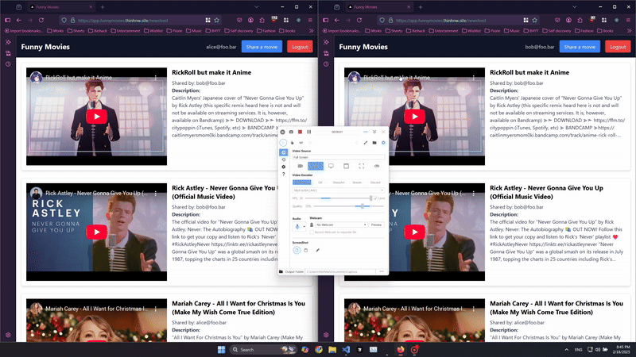

# Introduction


This app allows users to share and view videos, providing a seamless experience for video sharing and notifications. Here's how to use its core features:
#### Newsfeed 
- All shared videos are listed here. 
- Users can browse the latest shared videos.
#### User Management
- **Sign Up**: Create a new account to start sharing videos.
- **Log In**: Access your account and the app's features.
- **Log Out**: Securely sign out when you're done.
#### Video Sharing
- Users can share videos with others through the app.
- When a new video is shared, all other users will receive notifications.

The live app can be accessed through these domains:
- **Website:** https://app.funnymovies.thinhnw.site
- **API:** https://funnymovies.thinhnw.site

Sample users
  ```
  email: alice@foo.bar
  password: password

  email: bob@foo.bar
  password: password
  ```

# Prerequisites

Required software and tools:
- Ruby 3.3.6
- Rails 7.2.2
- Node 20.16.0
- Docker 27.1.1

# Installation & Configuration: 

 Clone the repository with its submodule (the front-end module will be installed in `www/funny-movies-fe` directory)
```sh
git clone --recurse-submodules https://github.com/thinhnw/funny-movies-api.git
cd funny-movies-api
```

Set the environment variables in 2 files `.env`, `db.env` in the same directory as `funny-movies-api`
```sh
#.env
RAILS_ENV=development
POSTGRES_USER=postgres
POSTGRES_PASSWORD=password
POSTGRES_HOST=postgres
POSTGRES_PORT=5432
REDIS_URL=redis://redis:6379/0
DEVISE_JWT_SECRET_KEY=some_secret_key #openssl rand -hex 32
YOUTUBE_API_KEY= #Get YouTube API key following the instruction below
ALLOWED_ORIGINS=http://localhost:3001

#db.env
POSTGRES_USER=postgres
POSTGRES_PASSWORD=password
```

Get your YouTube API key following the instructions from this link (https://developers.google.com/youtube/v3/getting-started)

Install the gems for Rails API
```sh
bundle install
```

Install the node modules for the front-end (need to change the directory first)
```sh
cd ./www/funny-movies-fe 
npm install
```

# Database Setup

We are running this whole setup with docker compose, so `docker compose up` everything first (the next section). Then we can exec the `rails db:` command inside `api` service:
```sh
docker compose exec api rails db:create 
docker compose exec api rails db:migrate
docker compose exec api rails db:seed
```

# Running the Application

We are running the whole development setup with docker compose.

Build and up all services in docker-compose.yml (api, postgres, redis, sidekiq, client), adminer is optional for database GUI
```sh
docker compose up -d --build
```

The Web client will be running on `localhost:3001` and the API will be running on `localhost:3000`

To run the test suite, it is necessary to be connected to the database and with `RAILS_ENV=test`
```sh
# Enter the api service's shell
docker compose exec api bash
# Run this command inside the container
RAILS_ENV=test bundle exec rspec
```

To test the front-end service, there are a few options here:
```sh
cd www/funny-movies-fe
npm run test
npm run test:ui
npm run test:silent
npm run test:coverage
```

# Docker Deployment 

Example of Docker Deployment with [Traefik](https://traefik.io/traefik/)
```yml
# /opt/traefik/docker-compose.yml
services:
  traefik:
    image: traefik:v3.1
    command:
      - "--api.insecure=true"
      - "--providers.docker=true"
      - "--entrypoints.web.address=:80"
      - "--entrypoints.websecure.address=:443"
      - "--certificatesresolvers.myresolver.acme.tlschallenge=true"
      - "--certificatesresolvers.myresolver.acme.email=user@example.com"  # Replace with your email
      - "--certificatesresolvers.myresolver.acme.storage=/letsencrypt/acme.json"
      - "--providers.docker=true"
      - "--providers.docker.exposedbydefault=false"
      - "--log.level=DEBUG"  # Set log level to DEBUG for more detailed logs
    ports:
      - "80:80"
      - "443:443"
        #      - "8080:8080"  # Traefik dashboard
    volumes:
      - /var/run/docker.sock:/var/run/docker.sock
      - ./letsencrypt:/letsencrypt  # Persistent storage for certificates
    networks:
      - traefik

networks:
  traefik:

```

Modify the main `docker-compose.yml` a little (build with `Dockerfile` instead of `Dockerfile.dev`, and add Traefik labels). You can keep other services as well (sidekiq, postgres, redis) or use a managed version of them instead.
```yml
# funny-movies-api/docker-compose.yml
services:
  # Rails service
  api:
    build:
      context: .
      dockerfile: Dockerfile  
    container_name: api
    command: bash -c "bundle install && bin/rails db:create db:migrate && rm -f tmp/pids/server.pid && bundle exec puma -C config/puma.rb"

    working_dir: /rails
    env_file:
      - .env
    networks:
      - traefik_traefik
      - backend
    labels:
      - "traefik.enable=true"
      - "traefik.http.routers.fm.rule=Host(`funnymovies.thinhnw.site`)"  # Replace with your domain
      - "traefik.http.routers.fm.entrypoints=websecure"
      - "traefik.http.routers.fm.tls=true"
      - "traefik.http.routers.fm.tls.certresolver=myresolver"
      - "traefik.http.services.fm.loadbalancer.server.port=3000"
      - "traefik.docker.network=traefik_traefik"

  # Next.js service
  client:
    build:
      context: ./www/funny-movies-fe 
      dockerfile: Dockerfile
      args:
        NEXT_PUBLIC_API_URL: https://funnymovies.thinhnw.site
        NEXT_PUBLIC_WS_URL: wss://funnymovies.thinhnw.site
    container_name: client
    restart: always
    working_dir: /app
    networks:
      - traefik_traefik
    labels:
      - "traefik.enable=true"
      - "traefik.http.routers.afm.rule=Host(`app.funnymovies.thinhnw.site`)"  # Replace with your domain
      - "traefik.http.routers.afm.entrypoints=websecure"
      - "traefik.http.routers.afm.tls=true"
      - "traefik.http.routers.afm.tls.certresolver=myresolver"
      - "traefik.http.services.afm.loadbalancer.server.port=3000"
      - "traefik.docker.network=traefik_traefik"

networks:
  backend:
    driver: bridge
  traefik_traefik:
    external: true

```

# Usage

1. **Sign Up (New Users)**  
   - Navigate to the "/signup" page.  
   - Enter your email and password to create an account.  
   - Upon successful sign-up, you will be automatically logged in and directed to the Newsfeed.  

2. **Log In (Returning Users)**  
   - Navigate to the "/login" page.  
   - Enter your email and password.  
   - Upon login, you will be taken to the Newsfeed.

3. **Newsfeed Browsing**  
   - The Newsfeed lists all shared videos chronologically, with the newest videos at the top.  
   - Users can click on any video to watch it directly within the app.  
   - Refresh the Newsfeed as needed to view new content.  

4. **Sharing a Video**  
   - Click the "Share a movie" button.  
   - Provide a YouTube video link.
   - Submit the form to share the video.  

5. **Notification System**  
   - When a video is shared by any user, all other users will receive a notification.  

6. **Logging Out**  
   - Users can log out at any time by clicking the "Logout" button


# Troubleshooting

1. `sidekiq` service might fail the first time you run (due to conflict in the database with api service), just try again
```sh
docker compose up -d sidekiq
docker compose ps #verify everything is running
```

2. Both rails' and nextjs' dependencies need to be installed first before you run with docker.

3. The front-end Docker deployment in production needs API_URL to be set before the build, so use `args`


